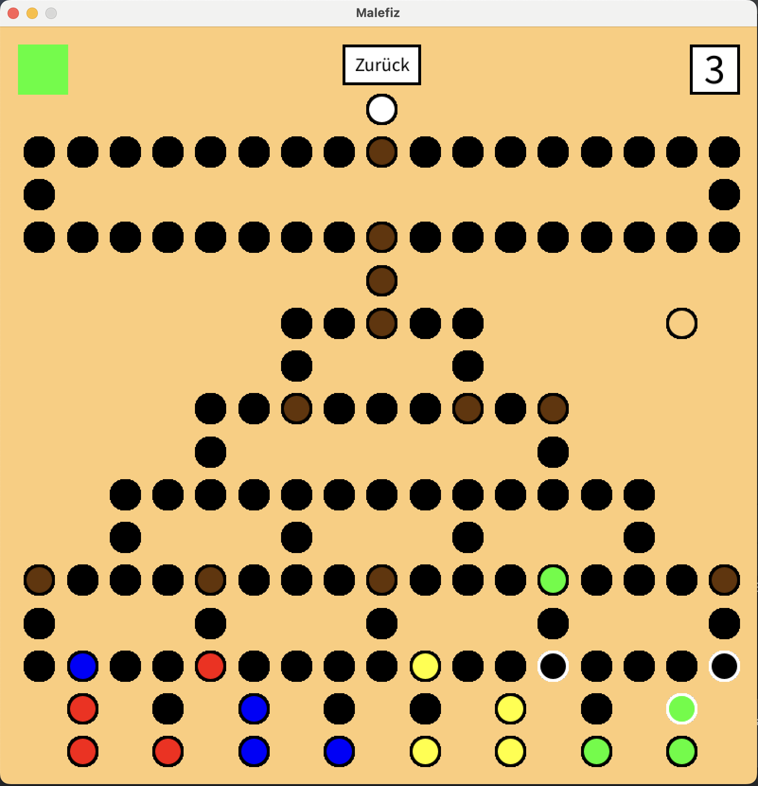

# Noch mal!

Malefiz, ein klassisches Brettspiel für Jung und Alt, begeistert seit Generationen Spieler weltweit mit seinem einfachen, aber strategischen Gameplay.

# Spielübersicht

Malefiz ist ein klassisches Brettspiel für 2 bis 4 Spieler, das ursprünglich in Deutschland entwickelt wurde. Ziel des Spiels ist es, als erster Spieler eine seiner fünf Spielfiguren auf die Spitze des Spielfelds zu bringen. Das Spielbrett ist mit Barrieren und speziellen Sperrfeldern versehen, die die Bewegung der Figuren beeinflussen und Strategie erfordern. Spieler können Barrieren nutzen, um Gegner zu blockieren, müssen aber auch geschickt manövrieren, um eigene Blockaden zu umgehen. Malefiz ist bekannt für seine Mischung aus Glück, Taktik und der Möglichkeit, Gegner durch geschicktes Blockieren zu behindern.

## Verwendete Bibliotheken
Das Programm verwendet die folgenden Bibliotheken:

- [Processing](https://processing.org)

## Screenshot
Ein Screenshot des laufenden Spiels:

## Startanleitung
Zum *Starten* müssen folgende Schritte berücksichtigt werden:

1. Öffnen der Datei `Main.java`
2. Starten der der Funktion `main()`